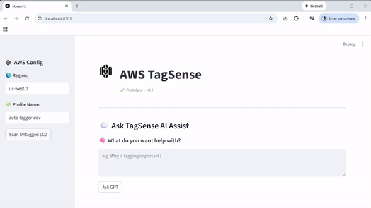

# 🏷️ AWS TagSense AI Assistant

**AWS TagSense** is an interactive, AI-powered assistant that helps cloud teams improve their AWS resource tagging hygiene. Built with **Streamlit** and integrated with **OpenAI GPT**, the app scans for untagged EC2 instances and provides contextual insights on tagging best practices and compliance — all in a clean, intuitive UI.

---

## ✨ Features

- 🔍 **Scan for Untagged EC2 Instances** by AWS region and profile
- 💬 **Ask the Assistant**: Get GPT-powered guidance on tagging policies, governance, and remediation
- 🧠 **Contextual AI Insights** based on scan results
- 🎯 Clean, focused UI designed for infrastructure practitioners

---

## 📸 Demo

 <!-- You can swap this out with an MP4 or still image -->

---

## 🚀 Getting Started

### 1. Clone the repo
```
bash

git clone https://github.com/your-username/aws-tagsense-ai-assistant.git

cd aws-tagsense-ai-assistant
```
